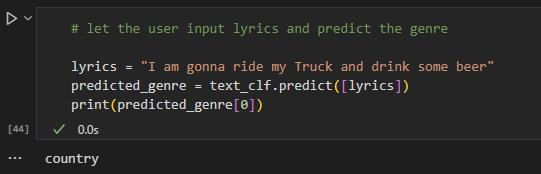

# Lyrics Genre Classifier

**A Multiclass Classifier That Identifies a Song’s Genre Based on Lyrics**  
Authors: **Mostafa Shalaby**, **Ethan Welburn**, **Ali Saleh**  
Institution: University of Victoria, Victoria, BC, Canada  

---

## Abstract

Classifying music genres based solely on song lyrics presents significant challenges due to the uniqueness of songs, copyright issues, and data representation biases. This project introduces a multiclass classifier that identifies a song's genre using only its lyrics. We focus on five distinct genres: rock, pop, jazz, hip hop, and country. 

To build a representative dataset, we collected lyrics using the Spotify and Genius APIs, navigating rate limits and copyright considerations. Preprocessing included noise removal, text cleaning, and augmented stopword handling to prevent overfitting. Term Frequency-Inverse Document Frequency (TF-IDF) analysis highlighted genre-specific words, while sentiment analysis explored the emotional tone across genres.

The classifier was trained using Support Vector Machines (SVM) and evaluated via accuracy scores, cross-validation, and confusion matrices. Results showed effective genre differentiation, with distinct patterns for genres like hip hop and country. We also provide insights from sentiment analysis and discuss avenues for future work, such as expanding genres and improving data balance.

---

## Keywords

- Multiclass Classification  
- Lyrics Analysis  
- Genre Prediction  

---

## Introduction

Music genres help categorize music based on patterns like rhythm, melody, and lyrics, as well as cultural or thematic origins. However, classifying a song's genre based solely on lyrics is challenging due to:  
- **Uniqueness of Songs**: Songs vary widely within a genre in themes and style.
- **Dataset Representation**: Building a representative dataset that captures the essence of genres can be difficult.

Natural Language Processing (NLP) techniques are instrumental in overcoming these challenges by analyzing lyrics for genre-specific patterns and themes.

---

## Methodology

### Data Collection
- **APIs Used**: Spotify and Genius APIs.  
- **Challenges**: API rate limits, copyright concerns, and ensuring a balanced dataset across genres.

### Data Preprocessing
- Noise removal and cleaning of non-lyrical content.
- Augmentation of stopwords to reduce overfitting risks.
- Final dataset saved as `cleaned_songs_data.csv`.

### Feature Engineering
- **TF-IDF**: To identify genre-specific terms.  
- **Sentiment Analysis**: To explore the emotional tone of each genre.

### Model
- **Classifier**: Support Vector Machine (SVM) for multiclass classification.  
- **Evaluation Metrics**: Accuracy scores, cross-validation, and confusion matrices.

---

## Results

- **Performance**: The classifier effectively differentiated between genres using lyrics.  
- **Patterns**: Genres like hip hop and country exhibited distinct linguistic traits.  
- **Sentiment Insights**: Emotional tones varied significantly between genres, enriching the classification.

---

## Challenges

1. **Uniqueness of Songs**: Intra-genre variations required robust preprocessing.
2. **Representative Dataset**: Careful curation was necessary to balance class distributions.
3. **Genre Ambiguity**: Certain songs exhibited cross-genre traits, complicating classification.

---

## Future Work

- Expand the genre set to include more categories.
- Improve data balance to enhance generalization.
- Explore additional NLP techniques like embeddings for deeper linguistic insights.

---

## Files in Repository

- `datascraper.py`: Script to scrape lyrics from Spotify and Genius APIs.
- `cleaning_lyrics.py`: Script to clean and preprocess raw lyrics data.
- `text_analysis.ipynb`: Notebook for exploratory data analysis and classifier training.
- `songs_data.csv`: Raw scraped lyrics data.
- `cleaned_songs_data.csv`: Preprocessed and cleaned lyrics dataset.
- `text_analysis_without_cleaning.ipynb`: Insights into analysis without text cleaning.

---

## License

This project is licensed under the [MIT License](LICENSE).
